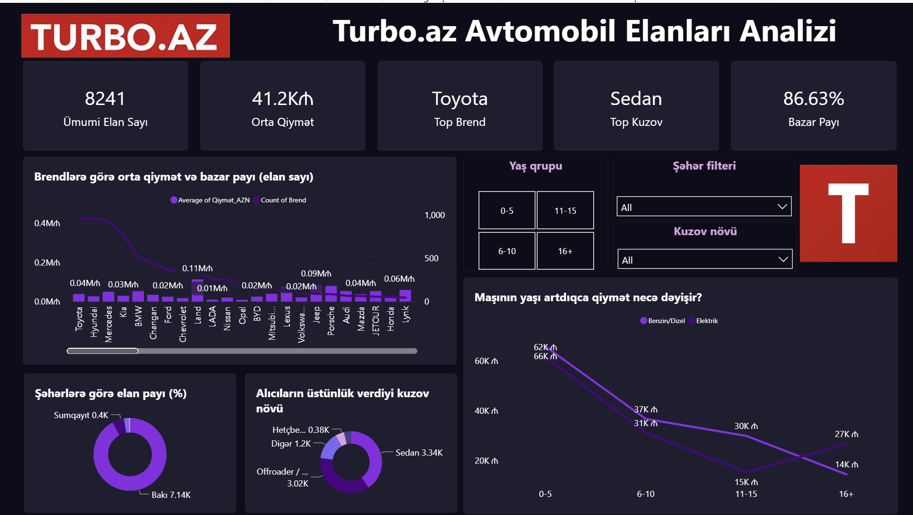
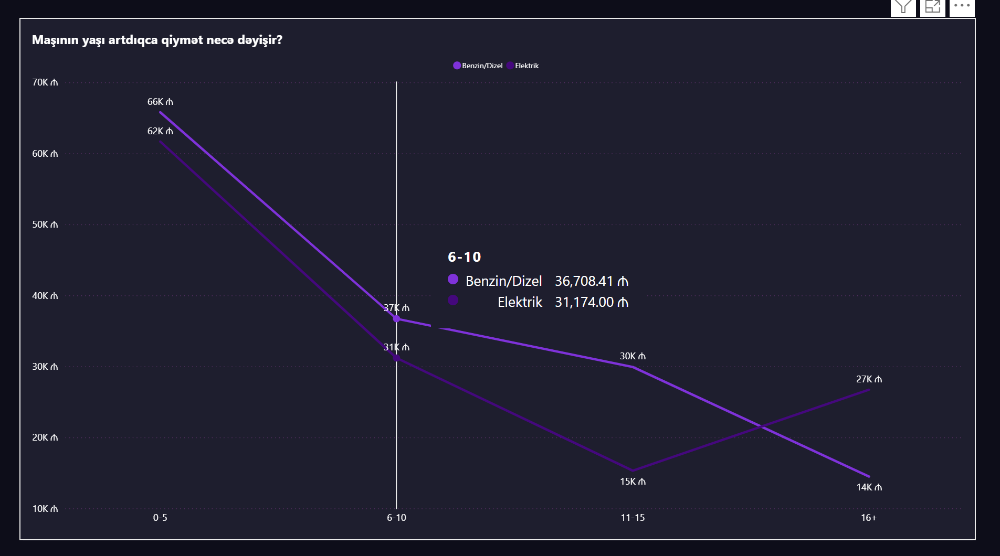
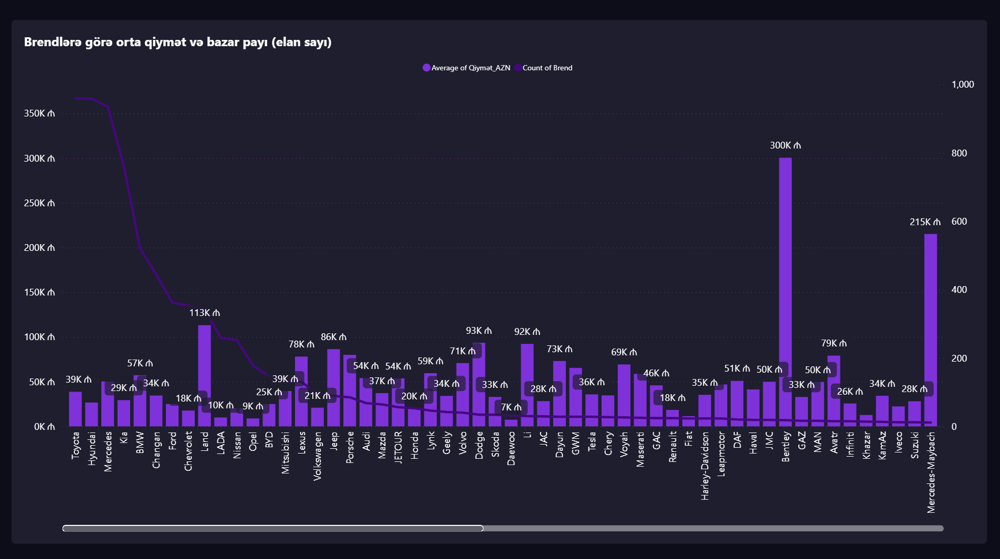

# 🚗 Turbo.az Car Market – Power BI Dashboard

## 📌 Project Overview
This project analyzes **Turbo.az car listings dataset** using **Power Query** for data cleaning and **Power BI** for visualization.  
The main goal was to transform raw, unstructured data into meaningful insights about Azerbaijan’s car market.

---

## 🧹 Data Cleaning (Power Query)
Key transformations applied in Power Query:
- **Price** → Converted to numeric (AZN) using `Change Type` and `Replace Values`.
- **Engine Type** → Created new column (`Conditional Column`) to separate Benzin/Diesel vs Electric.
- **Car Age** → Calculated from production year (`Custom Column`) and grouped into ranges: 0–5, 6–10, 11–15, 16+ years.
- **Cities** → Grouped into Baku, Sumgait, Ganja, and Other.
- **Body Types** → Simplified and grouped into main categories (Sedan, Offroader, Hatchback, etc.).
- **Previous Owners** → Removed column (too many null values, no analytical meaning).

---

## 📊 Dashboard Insights
1. **Total listings** → 8,241  
2. **Average price** → ~41,200 AZN  
3. **Most popular brand** → Toyota (Hyundai, BMW, Mercedes also strong)  
4. **Body type leaders** → Sedan & Offroader  
5. **City distribution** → 86–90% of listings are from Baku  
6. **Price vs Age** →  
   - 0–5 year cars: ~60K+  
   - 11–15 year cars: ~15K  
   - 16+ years: still present but very low value  
7. **Engine size distribution** → 1.6–2.0L most common, 3.0L+ mostly luxury cars  
8. **Luxury segment** → Mercedes, BMW, Porsche clearly visible with 3.0L+ engines and 100K+ prices  

---

## 🗂 Data Files
- `turboaz_raw.csv` → Raw dataset (uncleaned, original)  
- `Turboaz_Dashboard.pbix` → Power BI dashboard with cleaned data and visuals  

---

## 📸 Dashboard Preview

### 1. Dashboard Overview

### 2. Price vs Age Relation

### 3. Average Price & Listing Count by Brands

---

## 🔗 Related Link
- 💼 LinkedIn Post → [LinkedIn](https://www.linkedin.com/feed/update/urn:li:activity:7375511132586885120/)

---

## 🏷 Tags
`Power BI` · `Data Analytics` · `Data Visualization` · `Dashboard` · `Turbo.az` · `Azerbaijan`
